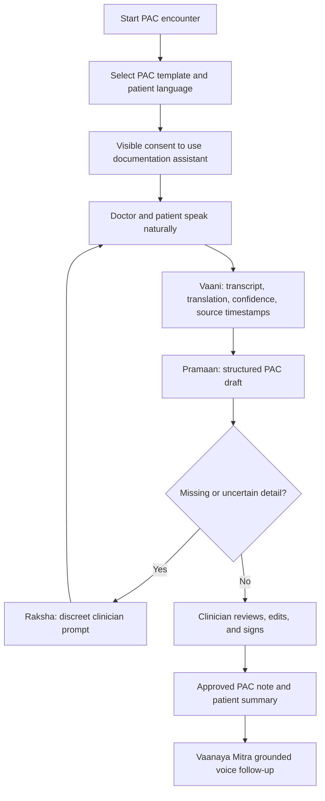
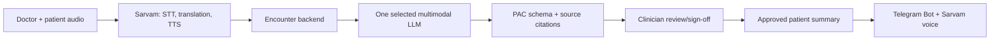

# Vaanaya — Detailed Product Requirements Document

**Status:** Draft for product-manager and clinical review  
**Product:** Vaanaya, a multilingual pre-anesthetic check-up (PAC) documentation copilot  
**MVP context:** Eight-hour buildathon prototype  
**Decision requested:** Approve a focused prototype covering one PAC template, two language paths, clinician review/sign-off, and grounded patient follow-up.

## 1. Executive summary

Vaanaya is a clinician-supervised, multilingual ambient documentation copilot for pre-anesthetic check-ups. It lets a doctor and patient speak naturally—even if they use different languages—while it creates an editable PAC draft, surfaces missing information, and generates doctor-approved preparation instructions in the patient’s language.

Vaanaya does not diagnose, prescribe, classify risk, choose an anesthetic plan, or finalize a record by itself. It drafts, translates, organizes, and maintains source links; the clinician reviews and signs every final record.

## 2. Inspiration and product thesis

The PAC is a high-stakes conversation: clinicians must listen carefully, explain risks and preparation, ask a complete history, and document the encounter at the same time. Those demands rise sharply when patient and clinician do not share a first language.

Vaanaya is built on four beliefs:

- Patients should be able to describe their history in the language in which they are most comfortable.
- Clinicians should not have to choose between patient attention and contemporaneous note-taking.
- The record should distinguish what was said, what remains unknown, and what the clinician ultimately approved.
- Patient instructions should remain understandable after the person leaves the hospital.

## 3. Problem statement

- PAC consultations are documentation-heavy; typing competes with patient attention.
- Language differences can reduce comprehension and create gaps in documentation.
- Unstructured or incomplete notes can weaken handover and the quality of the contemporaneous record.
- Patients often forget fasting, medication, test, document, and arrival instructions.

## 4. Product goals and boundaries

| Goals | Explicit non-goals |
|---|---|
| Create a high-quality PAC draft from a live conversation. | Diagnose, prescribe, determine anesthetic fitness, assign ASA class, or recommend an anesthetic plan. |
| Bridge supported Indian languages in both directions. | Promise flawless coverage of every dialect, accent, clinical term, or noisy setting. |
| Prompt clinician clarification of missing PAC information. | Silently infer facts or turn an AI suggestion into a clinical finding. |
| Produce patient-friendly, clinician-approved instructions. | Offer open-ended medical advice or replace hospital follow-up. |
| Maintain source-linked, reviewable documentation. | Claim legal protection, guaranteed consent, or voice-only identity verification. |

## 5. Users, personas, and jobs to be done

| User | Need | Vaanaya outcome |
|---|---|---|
| Anesthesiologist | Complete a PAC without continuous typing; retain final authority. | Source-linked draft, missing-item prompts, explicit sign-off. |
| PAC nurse/coordinator | Prepare encounters and identify missing administrative/clinical context. | Clear readiness and unresolved-item view. |
| Patient/caregiver | Explain history and understand next steps in a comfortable language. | Two-way language bridge and approved spoken/text summary. |
| OT team | Access concise approved context before surgery. | One-minute handover summary. |
| Hospital reviewer | Understand how documentation was created and approved. | Audit timeline with source, proposal, edits, and sign-off. |

### Primary clinician persona

**Dr. Meera**, an anesthesiologist, conducts a high volume of PAC consultations. She adopts Vaanaya only if review is faster than writing from scratch, the system stays quiet during the conversation, and it never appears to make a clinical decision for her.

### Jobs to be done

- When I conduct a PAC, help me leave with a complete, reviewable draft without turning the encounter into data entry.
- When a patient and I use different languages, help us understand each other without losing the original meaning.
- When I share instructions, help the patient remember only what I have approved.

## 6. End-to-end user journey

1. The clinician selects a patient, procedure context, and PAC template; the patient selects a preferred spoken language.
2. The encounter obtains visible consent for transcription/translation.
3. Doctor and patient speak normally. The system shows original utterance, translated meaning, timestamp, and confidence where applicable.
4. Vaanaya proposes PAC fields in the background and attaches source citations.
5. Raksha shows missing or uncertain template fields without interrupting the conversation.
6. The clinician edits, accepts, rejects, or adds content and explicitly signs the note.
7. The patient receives only a clinician-approved summary and can later ask constrained follow-up questions.

## 7. Product modules

### 7.1 Vaani — multilingual encounter layer

- Capture doctor and patient speech in supported languages and supported code-switching patterns.
- Display source utterance and translated meaning to clinician; optionally speak translated clinician explanations to patient.
- Mark low-confidence transcription, medication/allergy references, numbers, and clinical terms for confirmation.
- Preserve speaker role, source language, timestamp, and confidence for every clinically used segment.

### 7.2 Pramaan — structured PAC draft and evidence trail

- Populate a configurable PAC template from the encounter.
- Require every AI-proposed field to cite one or more transcript segments.
- Support clinician edit, accept, reject, and free-text addition on every field.
- Never auto-finalize a note.

### 7.3 Raksha — completeness prompts

- Compare captured information with required fields in the selected PAC template.
- Prompt neutrally: “Fasting status not captured—confirm?” rather than making a clinical conclusion.
- Separate **missing**, **uncertain**, and **intentionally skipped** states.
- Allow clinician dismissal with a reason.

### 7.4 Darpan — patient understanding check

- Offer a clinician-triggered teach-back question in the patient’s language.
- Summarize the patient’s response for clinician review.
- Record teach-back completion only after clinician confirmation; never equate it with legal consent.

### 7.5 Saar — one-minute handover

- Generate a clinician-approved OT-facing summary of relevant history, allergies, prior anesthesia issues, referenced investigations, and unresolved items.
- Link each item to the PAC note; introduce no new recommendation.

### 7.6 Vaanaya Mitra — patient follow-up bot

- Provide a secure Telegram entry point after clinician approval of patient-facing instructions.
- Accept text or voice questions in supported languages.
- Answer only from the approved patient summary and selected hospital instruction content.
- Escalate urgent, unsupported, or high-risk questions to a hospital contact.

### 7.7 Sankalp — future-facing consent/access concept

- Demonstrate patient voice-confirmed intent plus device passkey approval for scoped, time-limited prior-record access.
- Treat voice matching as supplementary only; it is never the sole authenticator or lookup mechanism.
- Exclude this from the clinical buildathon MVP.

## 8. Detailed use cases

### UC-01: Multilingual PAC documentation

**Actor:** anesthesiologist  
**Preconditions:** selected PAC template; patient language selected; consent acquired.

**Flow:**

1. Clinician opens encounter and begins consultation.
2. Vaanaya captures/bridges language and creates transcript segments.
3. Extraction service proposes PAC fields and citations.
4. Raksha identifies unanswered or uncertain template fields.
5. Clinician asks clarifying questions, reviews content, and signs.

**Success:** signed note contains clinician-approved content only; each generated field has a source link.

**Fallbacks:** Low confidence is marked for confirmation. Unsupported-language/dialect situations use a supported-language fallback or flag interpretation support. If recording is declined, consultation continues without ambient capture.

### UC-02: Patient instruction and teach-back

**Actor:** anesthesiologist or PAC nurse  
**Flow:** clinician selects approved instruction categories → Vaanaya generates plain-language text/audio → optional teach-back → clinician clarifies or approves.

**Success:** only approved instructions are shared, and the system does not make a consent claim.

### UC-03: Telegram follow-up

**Actor:** patient/caregiver  
**Flow:** patient sends voice/text query → bot transcribes and identifies language → searches only approved summary → returns grounded answer or escalation.

**Success:** bot never invents a new clinical instruction or diagnosis.

## 9. PAC template model

| Template section | Example contents | Entry rule |
|---|---|---|
| Encounter context | Procedure, date, location, patient language | Clinician/coordinator entered. |
| Medical history | Relevant comorbidities, prior procedures | AI may propose; clinician confirms. |
| Medication/allergy history | Medicines, allergies, reactions | AI may propose with source/confidence. |
| Prior anesthesia history | Previous anesthesia, complications, family history when captured | AI may propose; clinician confirms. |
| Fasting/readiness | Fasting status, reports/tests discussed, missing documents | Template-driven prompt plus clinician confirmation. |
| Investigations | Mentioned or uploaded mock reports | Reference only; do not interpret results. |
| Open items | Follow-up questions, tests, referrals | Clinician entered or accepted from prompt. |
| Clinician conclusion | Local workflow’s final assessment/plan fields | Always clinician entered. |

## 10. Functional requirements and acceptance criteria

| ID | Requirement | Acceptance criteria |
|---|---|---|
| FR-01 | Create encounter and choose PAC template. | Template loads before recording; required and optional fields are distinct. |
| FR-02 | Capture conversation only after visible consent. | Consent state is visible; capture cannot begin until it is recorded. |
| FR-03 | Show source speech, translation, and confidence. | Selecting an extracted field reveals source, speaker, language, timestamp, and translation. |
| FR-04 | Create schema-constrained draft PAC note. | Output maps only to defined template fields and includes source citations. |
| FR-05 | Identify missing/uncertain fields. | Prompt is passive, dismissible, and never framed as a diagnosis. |
| FR-06 | Allow clinician edit/reject/add content. | Every proposed field can be changed before sign-off. |
| FR-07 | Require explicit sign-off. | Finalization is impossible without clinician action. |
| FR-08 | Create patient-facing summary from approved content only. | Clinician preview/approval gate precedes sharing. |
| FR-09 | Ground Telegram responses. | Unsupported questions return escalation, not generated medical advice. |
| FR-10 | Maintain an audit history. | Timeline contains proposal, source links, edits, sign-off, and final version. |

## 11. Architecture and technology integration

| Layer | Technology | Responsibility | Guardrail |
|---|---|---|---|
| Conversation | Sarvam STT, translation, TTS | Multilingual capture, translation, patient-language audio | Preserve source IDs/confidence; transcript is not automatically clinical fact. |
| Extraction | GPT or Gemini multimodal API; choose one provider | Proposed fields, citations, approved-content summarization | Schema-constrained; no treatment recommendations or finalization. |
| Orchestration | Lightweight web backend and database | Encounters, templates, review state, audit events | Enforce approval gates. |
| Knowledge grounding | Curated PAC template and approved hospital instructions | Constrain outputs | No free-form clinical knowledge in patient bot. |
| Follow-up | Telegram Bot API + Sarvam voice | Constrained voice-note Q&A | Scoped session, minimal data, escalation. |
| Build acceleration | Codex, Claude Code, Cursor, similar | Scaffolding, UI, tests | Not a runtime dependency. |
| Future access | Passkey provider + specialist biometric service | Patient-controlled access | Voice never sole authentication. |

**Runtime decision:** use one primary extraction model in the live prototype to avoid inconsistent outputs.

## 12. Data model, permissions, and audit

| Object | Key fields |
|---|---|
| Encounter | Patient reference, template, language, state, consent status. |
| Transcript segment | Speaker role, source language, text, translation, timestamp, confidence. |
| Proposed field | Template field, proposed value, source IDs, confidence, model metadata. |
| Clinician edit | Field, before/after, editor, timestamp, reason where needed. |
| Final PAC note | Signed content, clinician identity, sign-off time, version. |
| Patient summary | Approved instruction payload, language, access expiry. |
| Follow-up event | Question class, grounded answer, escalation status. |

| Role | Permissions |
|---|---|
| Clinician | Conduct/review encounter, edit, sign, approve patient summary. |
| PAC coordinator | Start encounter, select template/language, inspect readiness; cannot sign. |
| Patient/caregiver | Consume approved summary; use constrained follow-up channel. |
| Administrator/auditor | View configured audit information; cannot alter clinical content. |

## 13. Safety, privacy, and non-functional requirements

### Safety and privacy requirements

- Use synthetic/mock patient data in the prototype; never demo identifiable clinical information.
- Obtain and display encounter-level consent before recording or transcription.
- Make review/sign-off unavoidable before any note is final or shared.
- Clearly label AI-generated text, uncertain transcription, and unresolved fields.
- Do not make diagnostic, medication, risk-classification, or anesthetic-plan decisions.
- Do not claim litigation prevention or legal validity.
- Limit Telegram content to approved instructions; production needs hospital-approved secure messaging and data governance.
- Do not use voice as sole authentication for health records.

### Non-functional requirements

| Area | Prototype target | Production direction |
|---|---|---|
| Latency | Conversation feels responsive in scripted demo. | Measure each service stage; set thresholds with clinicians. |
| Availability | Stable path plus pre-recorded fallback. | Defined degradation modes and redundant services where appropriate. |
| Accuracy transparency | Source and confidence visible. | Ongoing language/dialect and clinical-term evaluation. |
| Accessibility | High-contrast, low-clutter UI; readable summaries. | WCAG-aligned experience and language-appropriate audio/text. |
| Auditability | Mock event history. | Role-restricted, immutable audit history. |
| Security | No real data or secrets in demo. | Encryption, least privilege, key management, vendor and hospital security review. |

## 14. MVP scope and build plan

| Priority | Include | Defer |
|---|---|---|
| Must build | Multilingual conversation, structured PAC draft, clinician review/edit, patient-language summary. | EHR integration, production storage, broad language coverage, voice biometrics. |
| Strong differentiator | Raksha prompt, source-linked fields, Telegram grounded voice Q&A. | Autonomous recommendations or generic medical chatbot behavior. |
| Future demo layer | Sankalp storyboard with mock data and explicit concept label. | Live voiceprint enrollment, cross-hospital search, real records. |

| Timebox | Outcome | Cut line |
|---|---|---|
| Hour 0–1 | Confirm mock template, language pair, patient story, success criteria. | No EHR, biometrics, or broad chatbot work. |
| Hour 1–3 | Encounter screen, audio capture, Sarvam speech/translation, transcript fallback. | Use pre-recorded segments if streaming is unreliable. |
| Hour 3–5 | Schema extraction, source links, Raksha prompts, review/sign-off. | Prioritize sign-off over analytics. |
| Hour 5–6 | Approved patient-language summary and audio. | Preserve clinician gate. |
| Hour 6–7 | Telegram voice-note Q&A. | Use in-app follow-up if Telegram integration fails. |
| Hour 7–8 | Rehearse demo, capture fallback video/screens, simplify UI. | Remove features that weaken vertical slice. |

## 15. Demo narrative

1. A mock patient speaks Hindi or another selected language while the anesthesiologist speaks English.
2. Vaanaya translates the exchange and fills the PAC draft in the background.
3. The patient mentions a relevant prior issue; Pramaan reveals the source utterance behind the proposed field.
4. Fasting status is omitted; Raksha prompts the clinician to clarify.
5. Clinician reviews/signs the note and approves a simple patient-language preparation summary.
6. Patient sends Telegram voice note: “What should I do before surgery?” Vaanaya Mitra returns only the approved instruction in speech and text.
7. Close with Sankalp as a clearly labeled future concept: patient-controlled, time-limited access using a device passkey plus voice-confirmed intent.

## 16. Success metrics

| Metric | Prototype target |
|---|---|
| Draft completeness | Every demo template field is populated, missing, uncertain, or intentionally skipped. |
| Reviewability | Reviewer finds source evidence for a displayed field in one interaction. |
| Instruction clarity | Test user can state the correct preparation instruction after hearing summary. |
| Safety behavior | Finalization requires sign-off; unsupported Telegram question escalates. |
| Demo reliability | Full story completes in under five minutes using stable mock inputs. |

## 17. Risks and mitigations

| Risk | Mitigation |
|---|---|
| Translation/transcription error | Show source phrase, confidence, and clinician confirmation; test only selected languages. |
| Clinical overreach | Constrain to drafting, completeness prompts, and clinician-approved summaries. |
| Sensitive-data exposure | Use synthetic data; minimize Telegram content; plan secure links/consent for production. |
| Eight-hour feature overload | Build one complete vertical slice; show Sankalp as storyboard only. |
| Judge confusion | Lead with visible before/after: multilingual conversation becomes reviewed PAC note and understandable patient instructions. |

## 18. Open questions for PM and clinical review

1. Which PAC template and institution-specific fields should be the first design partner’s source of truth?
2. Which two or three language pairs should be supported and tested with clinicians?
3. What exact consent wording and recording policy apply to the first deployment environment?
4. Should follow-up ultimately use Telegram, hospital portal, WhatsApp, or secure SMS-link workflow?
5. What portions of encounter content must be retained, and for how long, under hospital policy and applicable law?
6. What prompt rate makes Raksha helpful rather than intrusive?
7. Should the first integration path be standalone export, later EHR/HIS integration, or direct integration?

## 19. Recommended next step

Validate the PAC template and mock consultation with an anesthesiologist. Then build one safe vertical slice:

**multilingual conversation → source-linked PAC draft → missing-item prompt → clinician sign-off → patient-language Telegram follow-up**
